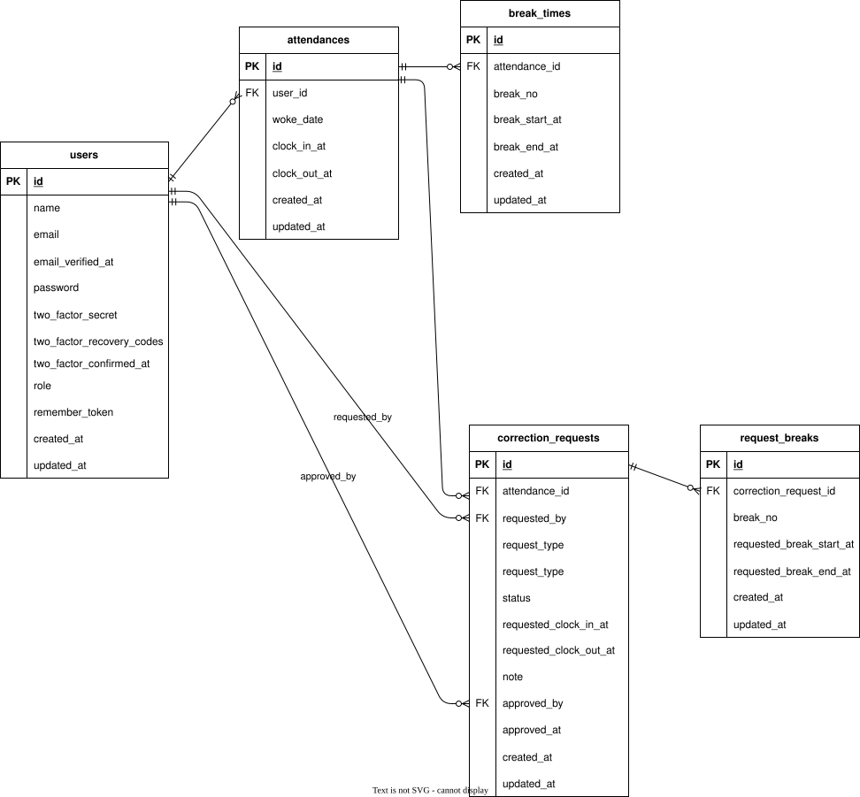

# 実践学習ターム 模擬案件初級\_勤怠管理アプリ

## プロジェクト概要

本プロジェクトは、COACHTECH 実践学習タームにおける模擬案件として開発した勤怠管理アプリです。
ユーザーの出退勤や休憩時間を記録・管理し、勤怠修正申請や承認フローを通じて、
実務に近い勤怠管理の仕組みを再現することを目的としています。。

本アプリでは、以下のような機能を実装しています。

- ユーザー登録・ログイン機能
- 出勤・退勤打刻機能
- 休憩の開始・終了記録機能（複数休憩対応）
- 勤怠一覧・詳細表示機能
- 勤怠修正申請機能（出退勤・休憩時間の修正）
- 管理者による申請承認機能

## 環境構築

### Docker ビルド

#### 1. リポジトリをクローン

```bash
git clone git@github.com:EriEndo/mock-attendance-app.git
cd mock-marketplace-app
```

#### 2. Docker の起動

```bash
Docker Desktop を起動
docker-compose up -d --build
```

### Laravel 環境構築

#### 1. Laravel のセットアップ

```bash
docker-compose exec php bash
composer install
cp .env.example .env
```

上記コマンドで .env ファイルを作成したら、開いて以下のように設定を変更します：

```text
DB_CONNECTION=mysql
DB_HOST=mysql
DB_PORT=3306
DB_DATABASE=laravel_db
DB_USERNAME=laravel_user
DB_PASSWORD=laravel_pass
```

#### 2. アプリケーションキーの作成

```bash
php artisan key:generate
```

#### 3. マイグレーションの実行

```bash
php artisan migrate
```

#### 4. シーディングの実行

```bash
php artisan db:seed
```

#### 補足

"The stream or file could not be opened"エラーが発生した場合は、ディレクトリ/ファイルの権限を変更してください

```bash
sudo chmod -R 777 src/storage
```

## 使用技術（実行環境）

| カテゴリ       | 技術                    | バージョン |
| -------------- | ----------------------- | ---------- |
| フレームワーク | Laravel                 | 8.83.8     |
| 言語           | PHP                     | 8.1.33     |
| Web サーバ     | Nginx                   | 1.21.1     |
| データベース   | MySQL                   | 8.0.26     |
| 管理ツール     | phpMyAdmin              | 最新       |
| コンテナ環境   | Docker / Docker Compose | 3.8        |

## 開発環境

| 項目                 | 内容                         |
| -------------------- | ---------------------------- |
| ユーザー登録画面     | http://localhost/register    |
| ユーザーログイン画面 | http://localhost/login       |
| 管理者ログイン画面   | http://localhost/admin/login |
| phpMyAdmin           | http://localhost:8080/       |

## ログイン情報

管理者

- 名前：山田太郎
- メールアドレス：test@example.com
- パスワード：password

ユーザー（スタッフ）

- 名前：山田太郎
- メールアドレス：test@example.com
- パスワード：password

## URL 一覧

本アプリでは、一般ユーザー機能はメール認証済みユーザーのみ利用可能です。  
未認証ユーザーがログインした場合は、メール認証案内ページへリダイレクトされます。

### メール認証フロー（未認証ユーザー向け）

| HTTP | URL                              | ルート名            | 説明                 | 備考              |
| ---- | -------------------------------- | ------------------- | -------------------- | ----------------- |
| GET  | /email/verify                    | verification.notice | メール認証案内ページ | auth 必須         |
| POST | /email/verification-notification | verification.send   | 認証メール再送       | auth + throttle   |
| GET  | /email/verify/{id}/{hash}        | verification.verify | 認証完了処理         | signed + throttle |

### 一般ユーザー機能（ログイン + メール認証必須）

| HTTP | URL                                         | ルート名                       | 説明                         |
| ---- | ------------------------------------------- | ------------------------------ | ---------------------------- |
| GET  | /attendance                                 | attendance.index               | 勤怠打刻画面                 |
| POST | /attendance/clock_in_at                     | attendance.clock_in_at         | 出勤打刻                     |
| POST | /attendance/clock_out_at                    | attendance.clock_out_at        | 退勤打刻                     |
| POST | /attendance/break_start                     | attendance.break_start         | 休憩開始                     |
| POST | /attendance/break_end                       | attendance.break_end           | 休憩終了                     |
| GET  | /attendance/list                            | attendance.list                | 勤怠一覧                     |
| GET  | /attendance/detail/{id}                     | attendance.detail              | 勤怠詳細                     |
| POST | /attendance/{attendance}/correction-request | stamp_correction_request.store | 勤怠修正申請                 |
| GET  | /stamp_correction_request/list              | stamp_correction_request.list  | 修正申請一覧（一般ユーザー） |

### 管理者機能（ログイン必須）

| HTTP  | URL                                          | ルート名                               | 説明                   |
| ----- | -------------------------------------------- | -------------------------------------- | ---------------------- |
| GET   | /admin/login                                 | admin.login                            | 管理者ログイン画面     |
| GET   | /admin/attendance/list                       | admin.attendance.list                  | 勤怠一覧（管理者）     |
| GET   | /admin/attendance/{id}                       | admin.attendance.detail                | 勤怠詳細（管理者）     |
| PATCH | /admin/attendance/{id}                       | admin.attendance.update                | 勤怠修正処理（管理者） |
| GET   | /admin/staff/list                            | admin.staff.list                       | スタッフ一覧           |
| GET   | /admin/staff/{id}/attendance                 | admin.staff.attendance                 | スタッフ別勤怠一覧     |
| GET   | /admin/staff/{id}/attendance/csv             | admin.staff.attendance.csv             | スタッフ別勤怠CSV出力  |
| GET   | /admin/stamp_correction_request/list         | admin.stamp_correction_request.list    | 修正申請一覧（管理者） |
| GET   | /admin/stamp_correction_request/{id}         | admin.stamp_correction_request.detail  | 修正申請詳細（管理者） |
| PATCH | /admin/stamp_correction_request/approve/{id} | admin.stamp_correction_request.approve | 修正申請承認           |

## ER 図



## テーブル仕様書

### users テーブル

| カラム名                  | 型                    | PK  | NN  |
| ------------------------- | --------------------- | --- | --- |
| id                        | bigint unsigned       | ○   |     |
| name                      | varchar(255)          |     | ○   |
| email                     | varchar(255)          |     | ○   |
| email_verified_at         | timestamp             |     |     |
| password                  | varchar(255)          |     | ○   |
| two_factor_secret         | text                  |     |     |
| two_factor_recovery_codes | text                  |     |     |
| two_factor_confirmed_at   | timestamp             |     |     |
| role                      | enum('user', 'admin') |     | ○   |
| remember_token            | varchar(100)          |     |     |
| created_at                | timestamp             |     |     |
| updated_at                | timestamp             |     |     |

### attendances テーブル

| カラム名             | 型              | PK  | NN  | UQ  | FK       | 補足                       |
| -------------------- | --------------- | --- | --- | --- | -------- | -------------------------- |
| id                   | bigint unsigned | ○   |     |     |          |                            |
| user_id              | bigint unsigned |     | ○   |     | users.id |                            |
| work_date            | date            |     | ○   |     |          |                            |
| clock_in_at          | time            |     |     |     |          |                            |
| clock_out_at         | time            |     |     |     |          |                            |
| created_at           | timestamp       |     |     |     |          |                            |
| updated_at           | timestamp       |     |     |     |          |                            |
| (user_id, work_date) |                 |     |     | ○   |          | 複合 UQ, 1ユーザー1日1勤怠 |

### break_times テーブル

| カラム名                  | 型              | PK  | NN  | UQ  | FK             | 補足                           |
| ------------------------- | --------------- | --- | --- | --- | -------------- | ------------------------------ |
| id                        | bigint unsigned | ○   |     |     |                |                                |
| attendance_id             | bigint unsigned |     | ○   |     | attendances.id |                                |
| break_no                  | tinyint         |     | ○   |     |                |                                |
| break_start_at            | time            |     |     |     |                |                                |
| break_end_at              | time            |     |     |     |                |                                |
| created_at                | timestamp       |     |     |     |                |                                |
| updated_at                | timestamp       |     |     |     |                |                                |
| (attendance_id, break_no) |                 |     |     | ○   |                | 複合 UQ, DB レベルで重複を防止 |

### correction_requests テーブル

| カラム名               | 型                                   | PK  | NN  | FK             | 補足               |
| ---------------------- | ------------------------------------ | --- | --- | -------------- | ------------------ |
| id                     | bigint unsigned                      | ○   |     |                |                    |
| attendance_id          | bigint unsigned                      |     | ○   | attendances.id |                    |
| requested_by           | bigint unsigned                      |     | ○   | users.id       |                    |
| request_type           | enum('user_request', 'admin_direct') |     | ○   |                |                    |
| status                 | enum('pending', 'approved')          |     | ○   |                | デフォルト:pending |
| requested_clock_in_at  | time                                 |     |     |                |                    |
| requested_clock_out_at | time                                 |     |     |                |                    |
| note                   | text                                 |     | ○   |                |                    |
| approved_by            | bigint unsigned                      |     |     | users.id       |                    |
| approved_at            | timestamp                            |     |     |                |                    |
| created_at             | timestamp                            |     |     |                |                    |
| updated_at             | timestamp                            |     |     |                |                    |

### request_breaks テーブル

| カラム名                          | 型              | PK  | NN  | UQ  | FK                     | 補足                           |
| --------------------------------- | --------------- | --- | --- | --- | ---------------------- | ------------------------------ |
| id                                | bigint unsigned | ○   |     |     |                        |                                |
| correction_request_id             | bigint unsigned |     | ○   |     | correction_requests.id |                                |
| break_no                          | tinyint         |     | ○   |     |                        |                                |
| requested_break_start_at          | time            |     |     |     |                        |                                |
| requested_break_end_at            | time            |     |     |     |                        |                                |
| created_at                        | timestamp       |     |     |     |                        |                                |
| updated_at                        | timestamp       |     |     |     |                        |                                |
| (correction_request_id, break_no) |                 |     |     | ○   |                        | 複合 UQ, DB レベルで重複を防止 |

## データベース初期化について（重要）

本アプリケーションでは、MySQL コンテナ起動時に  
`docker/mysql/initdb.d` 配下の SQL を実行し、必要なデータベースを自動作成しています。

### 自動で作成されるデータベース

- 開発用データベース：`laravel_db`
- テスト用データベース：`demo_test`

### 初回セットアップ時の注意

MySQL のデータは `docker/mysql/data` に永続化されています。  
**このディレクトリが存在する場合、初期化 SQL は実行されません。**
clone 直後や、DB を作り直したい場合は、以下を実行してください。
この操作により、データベース内のデータはすべて削除されます。

```bash
docker compose down
sudo rm -rf docker/mysql/data
docker compose up -d
```

## テストの実行方法

※初回セットアップ時は、事前に「データベース初期化について（重要）」を確認してください。

本アプリケーションでは、Laravel の PHPUnit を用いてテストを実行します。テストは **テスト専用の環境（.env.testing）** を使用して行われます。  
すべて **PHP コンテナ内** で実行してください。以下のコマンドでコンテナに入ります。

```bash
docker-compose exec php bash
```

### 1. テスト環境の設定ファイル作成

```bash
cp .env.testing.example .env.testing
```

### 2. アプリケーションキーの生成

```bash
php artisan key:generate --env=testing
```

### 3. テスト用データベースのマイグレーション・シーディング

```bash
php artisan migrate:fresh --seed --env=testing
```

※ このコマンドはテスト用データベースを初期化します。

### 4. テストの実行

全テストを実行する場合

```bash
php artisan test
```

特定のテストクラスを実行する場合　（例）

```bash
php artisan test --filter=RegisterTest
```

特定のテストメソッドを実行する場合　（例）

```bash
php artisan test --filter=test_user_can_register
```

### 5. 注意事項

- テスト実行時は 必ずテスト用データベース が使用されます
- 本番用・開発用データベースには影響しません
- テスト内で作成されるデータは、各テスト終了時に自動的にロールバックされます

## 実装にかかる補足事項

### seed データの内容

- マスタデータ（カテゴリ、商品状態）

- ユーザーおよびプロフィール
    - プロフィールが入力済みのユーザー
    - 未入力項目を含むユーザー  
      の両方の状態を再現

- 商品
    - ユーザーに紐付いた商品出品データを作成
    - 商品とカテゴリが紐付いた状態

- いいね
    - 商品に対するいいねデータを作成

- コメント
    - ユーザーと商品に紐付いたコメントデータを作成

- 購入
    - 一部商品を購入済み状態
    - purchase レコードと紐づいた状態
